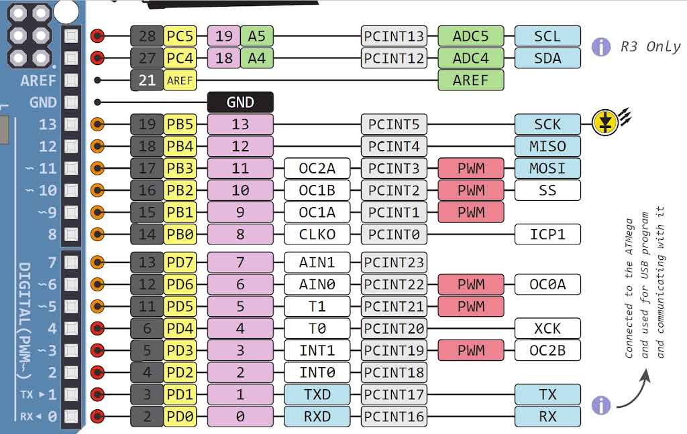

# led control by push button written in pure c
- so the thing which is cool about this mini project is that, the code is written in the embedded c or bare metal c you can say this , in this mini project we dont use the arduino libraries and the arduino language which are highly abstracted , while it makes it easy to prototype but it aint the best way to do stuff , when the memory space is the requirement , like when you are kind of have this requirement of like speed and efficient use of the memory and also want your project to have good performance and no lags and unexpected behaviour.
---
## My setup

- so my setup uses the vs code + platformio extesnion+ wokwi for vs code + other dependencies.
- so the platformio helps you in setting up your project for most kind of the board which you can select while creating a project and with the help of this extesnion if you want to write the  code for esp32 and other boards you can simply do that. 
- wokwi for vs code is the cool extension too , it lets you to simulate various kind of the board and very good for the people who dont have boards , but would like to learn  and practice their skills while learning the stuffs.
---
## project info 

- so this isnt very much advanced project, as the name suggest we are trying to cotrol the led with the help of the push button but the twist with not using the arduino digital write and read function which kind of abstract away the low level details and is kind of too slow than using the pure c one.

- watch the demo video of the mini project and how it works
[demo_video](./demo_video.mp4)

---
## pin out


- in the above image you can see the portb pins from the 8 to 13 and there are 2 other pins too, but in this mini project we are using the two of them i.e pin 8 and pin 9 of the uno.
---
## code explanation

```c
#include <avr/io.h> // this includes the avr registers like port registers, data direction etc
#include <util/delay.h>// its used to introduce delay in the code.

int main(void){
  DDRB = 0x02; // so this the data direction register, writing 1 makes the pin to configure as the output
               // and by default all are set to 0, that means input
               // to set the 9 as output we have to write the 1 and for 8 to be input we will write 0 and will
               //leave the rest of them as default, and the 0b0000_0010(binary) == 0x02 (in hexa)
  while (1)
  { if(PINB&(0x01)){ // pinb reads the input state at the portb register, its used to only read purpose
                    // we  read the first bit by using the & (and bitwise), so if 1 then the following case
                    //happen
    PORTB^=(0x02); // this toggles the output at the output bit , if 1 to the zero.
    _delay_ms(200);// adding delays
  }  
  }
  return 0;
}
```
---
## THANK YOU FOR READING!!